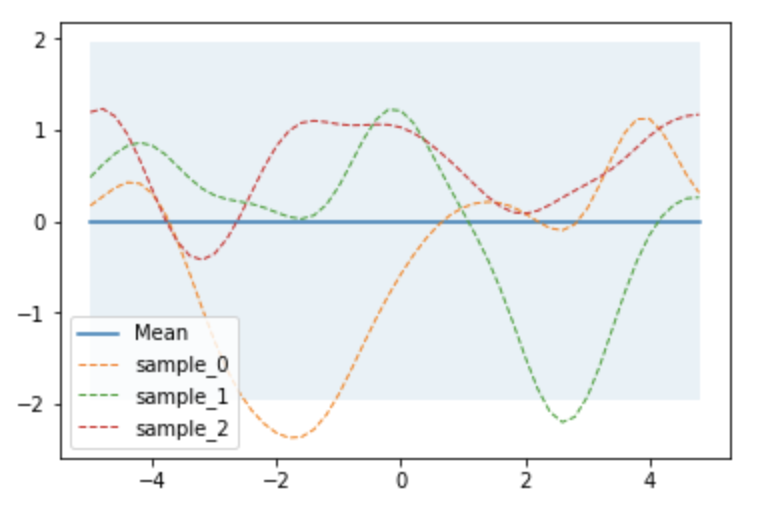
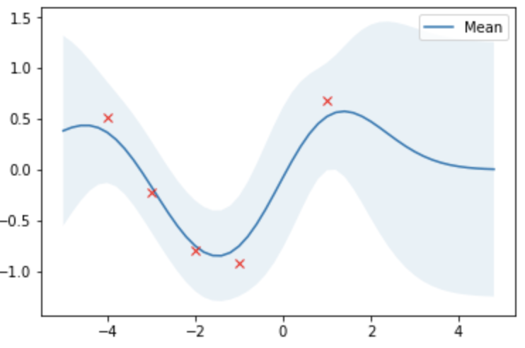

# np-gaussian-process
Numpy implementation of Gaussian Process Regression.

- Reference from [krasserm](http://krasserm.github.io/2018/03/19/gaussian-processes/).
- Copyright (c) 2018 krasserm. [np-gaussian-regression](https://github.com/revsic/np-gaussian-process) is licensed under [Apache 2.0](./LICENSE).

## Gaussian process regression

### 1. Kernel definition

This notebook will use Gaussian RBF as default kernel.

```python
kernel = gaussian_rbf
```

### 2. Define prior

Zero mean and covariance from kernel.

```python
X = np.arange(-5, 5, 0.2).reshape(-1, 1)
mu = np.zeros(X.shape)
cov = kernel(X, X)
```



### 3. Compute posterior

Compute posterior with gaussian process regression.

```python
X_train = np.array([-4, -3, -2, -1, 1]).reshape(-1, 1)
Y_train = np.sin(X_train)

mu_s, cov_s = posterior_predictive(X, X_train, Y_train)
```


### 4. Training data with noise

Assume training data has noise with zero mean and 0.3 stddev.

```python
noise = 0.3
Y_train = np.sin(X_train) + noise * np.random.randn(*X_train.shape)

mu_s, cov_s = posterior_predictive(X, X_train, Y_train, sigma_y=noise)
```


### 5. GPR with several parameters

Simulate gaussian process regression with several parameters.


### 6. Optimize hyper parameters with gradient based algorithm

Optimize parameters to maximize liklihood of posterior predictive.

